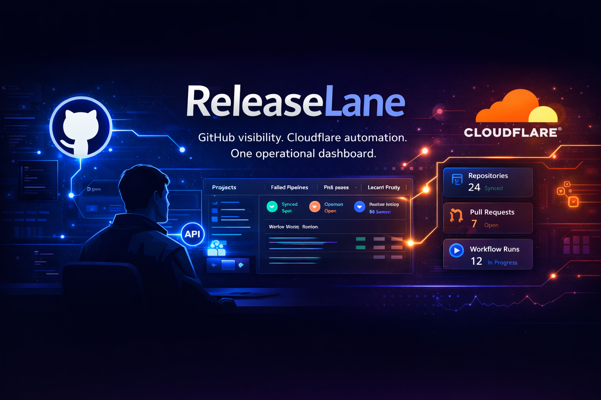

# ReleaseLane

**ReleaseLane** is an operational dashboard built with **Laravel** that integrates with **GitLab** to monitor projects, pipelines, merge requests, and release-related events in one place.

> Internal dev workflow visibility for projects, pipelines, and releases.

---

## Overview

ReleaseLane is designed as an internal tool for developers, freelancers, and small teams who want a cleaner operational view over their GitLab activity.

Instead of jumping between multiple GitLab pages, ReleaseLane aims to provide a focused dashboard for:

- project visibility
- pipeline monitoring
- merge request tracking
- webhook event logging
- release-oriented operational overview

The project is intentionally scoped as a practical MVP first, with room for future automation and cloud integrations.

---

## Core Features

- GitLab personal access token integration
- Projects synchronization
- Pipelines overview
- Merge requests overview
- GitLab webhook listener
- Event log and activity timeline
- Operational dashboard with recent activity
- Foundation for future release/deployment tracking

---

## Planned MVP Modules

### Authentication
- User login/logout
- Basic access control

### GitLab Connection
- GitLab base URL configuration
- Personal access token storage
- Connection test
- Sync trigger

### Projects
- Projects list
- Project details
- Default branch
- Quick project links

### Pipelines
- Pipeline status
- Branch / ref
- Commit SHA
- Timing information
- Quick access to pipeline URL

### Merge Requests
- Open and recent merge requests
- Source/target branches
- Author
- Status and updated date

### Webhook Events
- GitLab webhook endpoint
- Event type recognition
- Raw payload storage
- Summary generation for dashboard visibility

### Dashboard
- Recent pipelines
- Failed pipelines
- Open merge requests
- Recent webhook activity
- High-level project overview

---

## Tech Stack

- **Laravel 12**
- **PHP 8.3+**
- **PostgreSQL**
- **Blade**
- **Livewire**
- **Tailwind CSS**
- **GitLab REST API**
- **GitLab Webhooks**
- **Docker / Docker Compose**

---

## Architecture Direction

ReleaseLane follows a simple architecture for the MVP:

- **Laravel** as the main backend and UI layer
- **PostgreSQL** for local data persistence
- **GitLab API** for synchronization of projects, pipelines, and merge requests
- **GitLab Webhooks** for real-time event ingestion

Future versions may include:
- queue-based event processing
- release/deployment tracking
- Cloudflare Workers / Queues integration
- alerting and automation features

---

## Project Status

**Current status:** MVP in progress

This repository is focused on building the first usable internal version of ReleaseLane.

---

## Screenshots

Screenshots and UI previews will be added as the project evolves.

<!-- Example:


-->

---

## Repository Structure

```text
release-lane/
├── app/
│   ├── Http/
│   ├── Models/
│   ├── Services/
│   │   └── GitLab/
│   └── Actions/
├── bootstrap/
├── config/
├── database/
│   ├── factories/
│   ├── migrations/
│   └── seeders/
├── docs/
│   ├── banner/
│   └── screenshots/
├── public/
├── resources/
│   ├── css/
│   ├── js/
│   └── views/
├── routes/
├── storage/
├── tests/
├── docker/
├── docker-compose.yml
└── README.md
```

---

## Data Model (Initial MVP)

Planned core tables:

- `users`
- `gitlab_connections`
- `projects`
- `pipelines`
- `merge_requests`
- `webhook_events`

These tables provide the minimum foundation needed for synchronization, monitoring, and event tracking.

---

## Planned Routes

```php
/login
/dashboard

/settings/gitlab
/settings/gitlab/test
/settings/gitlab/sync

/projects
/projects/{project}

/projects/{project}/pipelines
/projects/{project}/merge-requests
/projects/{project}/events

/events
/webhooks/gitlab
```

---

## Local Development

### Requirements

- PHP 8.3+
- Composer
- Docker + Docker Compose
- PostgreSQL
- Node.js + npm

### Installation

```bash
git clone https://github.com/YOUR_USERNAME/release-lane.git
cd release-lane
cp .env.example .env
composer install
npm install
php artisan key:generate
```

### Start the environment

Depending on your setup:

```bash
docker compose up -d
```

or run Laravel locally:

```bash
php artisan serve
npm run dev
```

### Run migrations

```bash
php artisan migrate
```

---

## Environment Variables

Example variables expected for local development:

```env
APP_NAME=ReleaseLane
APP_ENV=local
APP_KEY=
APP_DEBUG=true
APP_URL=http://localhost

DB_CONNECTION=pgsql
DB_HOST=postgres
DB_PORT=5432
DB_DATABASE=releaselane
DB_USERNAME=releaselane
DB_PASSWORD=secret

GITLAB_URL=https://gitlab.com
GITLAB_TOKEN=
GITLAB_WEBHOOK_SECRET=
```

---

## GitLab Integration Plan

ReleaseLane connects to GitLab through:

1. **REST API**  
   for fetching:
   - projects
   - pipelines
   - merge requests

2. **Webhooks**  
   for receiving:
   - pipeline events
   - merge request events
   - push/release-related events

This allows the application to combine synchronized data with near real-time operational activity.

---

## Roadmap

### v0.1
- Laravel project bootstrap
- Auth setup
- Base layout and dashboard shell
- Initial database schema

### v0.2
- GitLab connection configuration
- GitLab service layer
- Projects sync

### v0.3
- Pipelines and merge requests
- Project details view

### v0.4
- Webhook listener
- Event log
- Dashboard activity widgets

### v0.5
- UI polish
- README assets
- screenshots
- sample/demo data

### Future
- release tracking
- deployment environments
- rerun / trigger actions
- queue-based processing
- Cloudflare integration
- notifications and alerts

---

## Why This Project

ReleaseLane is meant to be a practical portfolio project that reflects real-world backend and operational concerns:

- external API integration
- webhook ingestion
- internal tooling
- dashboard design
- event visibility
- release workflow awareness

It is not intended to replace GitLab, but to provide a more focused internal operational layer around it.

---

## Banner / Branding Notes

This repository is intended to include a branded banner at the top of the README.

Suggested direction:
- modern dev-tool aesthetic
- dark or cool-toned background
- subtle pipeline / lane / flow motif
- clean typography
- GitLab/release operations vibe

Banner placeholder path:

```text
./docs/banner/releaselane-banner.png
```

---

## License

License will be added later.

---

## Author

Created by **Grzegorz Krajewski**.
